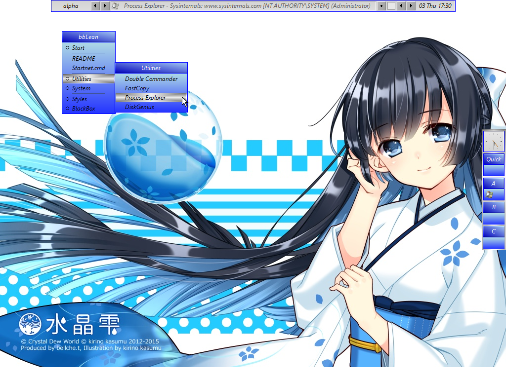
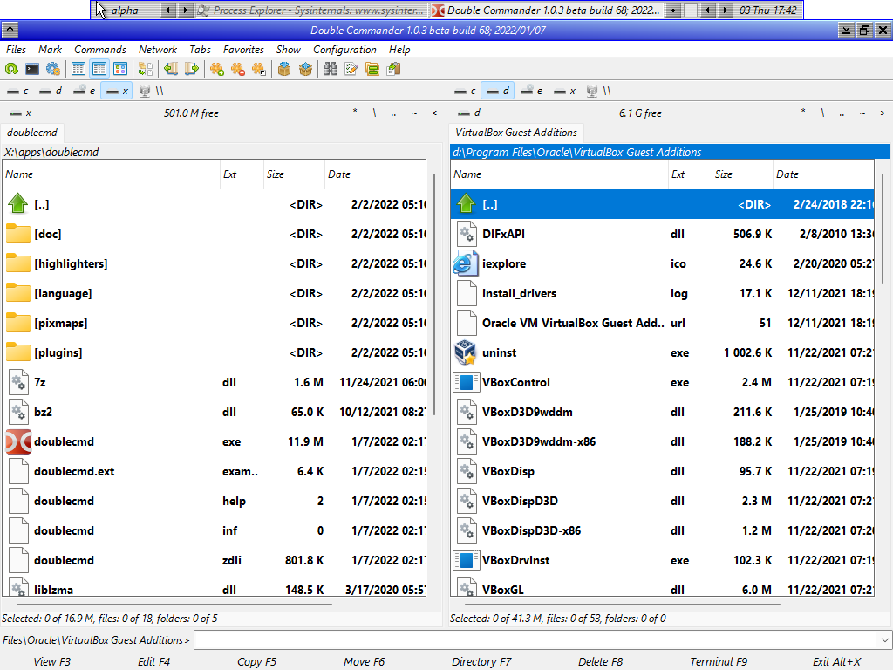

# My WinPE

## Description
This my personal [Windows PE (WinPE)](https://docs.microsoft.com/en-us/windows-hardware/manufacture/desktop/winpe-intro) build. It primarily reflects my personal interests. It never intends to compete with those Linux LiveCDs, nor does it want to substitute for [wepe](https://www.wepe.com.cn) or [老毛桃winpe](https://www.laomaotao.net/).

Utilities include:
* [bbLean](http://bb4win.sourceforge.net/bblean/) that establishs an old-school user interface
* [busybox](https://frippery.org/busybox/) that yields some unix feel
* [Double Commander](https://doublecmd.sourceforge.io/) that replaces explorer.exe. I am including it because you can edit text files, read binary file in hex format, view images with this awesome utility.
* [FastCopy](https://fastcopy.jp/)
* [DiskGenius](https://www.diskgenius.cn/)
* [WinFR (Windows File Recovery)](https://aka.ms/winfrhelp) that recovers deleted files
* [TestDisk and PhotoRec 7.1](https://www.cgsecurity.org/) that also covers disk and file recovery

**Notice** Due to the mechanism of `winpeshl.exe`, you need to terminate the last running process listed in `%SYSTEMROOT%\System32\winpeshl.ini` to reboot. For my build, that is bbLean/Blackbox. To do so, right click the desktop and locate Blackbox > Quit.

## Screenshots



## Use cases
### Unlock bitlocker
Assume you have backed up your bitlocker keys/passwords in advance, you can unlock with
```cmd
manage-bde -unlock D: -rk E:\path\to\your\key
```
or
```cmd
manage-bde -unlock D: -rp YOUR-BITLOCKER-PASSWORD
```

### Using the doublecmd to open directory by default
Assume you have installed doublecmd into `X:\apps\doublecmd\doublecmd.exe` in the PE.

1. Mount the PE image with `Dism /Mount-Image /ImageFile:%IMGSRC% /index:1 /MountDir:_mount`, replace `%IMGSRC%` with the path to the wim image.
2. Run `regedit` and load this hive: `_mount\windows\system32\config\SOFTWARE` into HKLM. Name it something that makes sense (i.e winpe_software).
3. Write the following into the PE registry (`tools/install_double_cmd_as_default.reg`):
```
Windows Registry Editor Version 5.00

[HKEY_LOCAL_MACHINE\winpe_software\Classes\Drive\shell]
@="open"

[HKEY_LOCAL_MACHINE\winpe_software\Classes\Drive\shell\open]

[HKEY_LOCAL_MACHINE\winpe_software\Classes\Drive\shell\open\command]
@="X:\\apps\\doublecmd\\doublecmd.exe -C -T --no-splash -R \"%1\""

[HKEY_LOCAL_MACHINE\winpe_software\Classes\Directory\shell]
@="open"

[HKEY_LOCAL_MACHINE\winpe_software\Classes\Directory\shell\open]

[HKEY_LOCAL_MACHINE\winpe_software\Classes\Directory\shell\open\command]
@="X:\\apps\\doublecmd\\doublecmd.exe -C -T --no-splash -R \"%1\""
```
4. Unload this registry hive.
5. Commit changes with `Dism /Unmount-Image /MountDir:_mount /commit`.

## How to build the WinPE image
You probably need a legal copy of Windows to proceed. Generally, you should follow these steps:
1. Install ADK **and** ADK Windows PE Addon. Follow this documention on [ADK](https://docs.microsoft.com/en-us/windows-hardware/manufacture/desktop/winpe-create-usb-bootable-drive) and this on [creating bootable media](https://docs.microsoft.com/en-us/windows-hardware/manufacture/desktop/winpe-create-usb-bootable-drive).
2. Open a terminal with administrative privilege and run `C:\Program Files (x86)\Windows Kits\10\Assessment and Deployment Kit\Deployment Tools\DandISetEnv.bat`.
3. Run `copype amd64 WinPE_amd64`.
4. Check and modify `my-winpe.cmd`. Obtain the utilities you need. Then run `my-winpe.cmd`.
5. Optionally test your image in a virtual machine.
6. Write it to a flash disk with `MakeWinPEMedia /ufd WinPE_amd64 J:` (assuming your flash disk has drive letter J).

**Notice** The partition table of your flash disk has to be MBR, otherwise `MakeWinPEMedia /ufd` [would fail](https://docs.microsoft.com/en-us/answers/questions/249767/makewinpemedia-fails-for-me.html).

## Looks cool, do you have a pre-built thing for me to try instantly?
Unfortunately, the answer is no for the time being. Largely due to the legal things I can't understand. To name a few:
* Current build requires you to copy your `C:\Windows\System32\oledlg.dll` to the PE image. Probably not proper to redistribute.
* It is not clear whether it is legal to redistribute Windows PE images, the 3rd-parth utilites (especailly the proprietary ones) and the Shizuku wallpaper.
