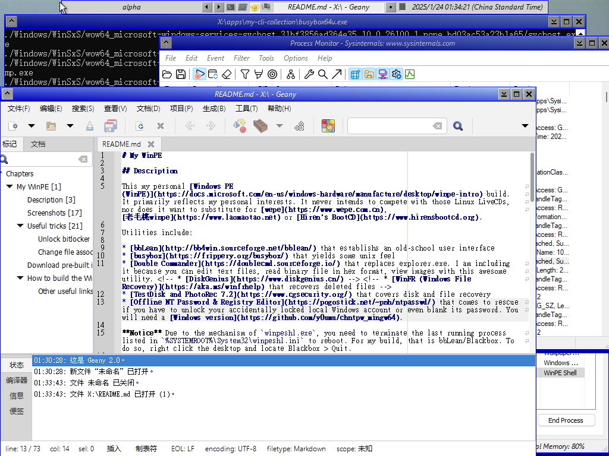

# My WinPE

## Description
This my personal [Windows PE (WinPE)](https://docs.microsoft.com/en-us/windows-hardware/manufacture/desktop/winpe-intro) build. It primarily reflects my personal interests. It never intends to compete with those Linux LiveCDs, nor does it want to substitute for [wepe](https://www.wepe.com.cn),  [老毛桃winpe](https://www.laomaotao.net) or [Hiren's BootCD](https://www.hirensbootcd.org).

Utilities include:
* [bbLean](http://bb4win.sourceforge.net/bblean/) that establishs an old-school user interface
* [busybox](https://frippery.org/busybox/) that yields some unix feel
* [Double Commander](https://doublecmd.sourceforge.io/) that replaces explorer.exe. I am including it because you can edit text files, read binary file in hex format, view images with this awesome utility.
<!-- * [DiskGenius](https://www.diskgenius.cn/) -->
<!-- * [WinFR (Windows File Recovery)](https://aka.ms/winfrhelp) that recovers deleted files -->
* [TestDisk and PhotoRec 7.2](https://www.cgsecurity.org/) that also covers disk and file recovery
* [Offline NT Password & Registry Editor](https://pogostick.net/~pnh/ntpasswd/) that comes to rescue if you have to unlock your accidentally locked local Windows account or even blank its password. You will need a [Windows version](https://github.com/y0umu/chntpw_mingw64).

**Notice** Due to the mechanism of `winpeshl.exe`, you need to terminate the last running process listed in `%SYSTEMROOT%\System32\winpeshl.ini` to reboot. For my build, that is bbLean/Blackbox. To do so, right click the desktop and locate Blackbox > Quit.

## Screenshots



## Use cases
### Unlock bitlocker
Assume you have backed up your bitlocker keys/passwords in advance, you can unlock with
```cmd
manage-bde -unlock D: -rk E:\path\to\your\key
```
or
```cmd
manage-bde -unlock D: -rp YOUR-BITLOCKER-PASSWORD
```

## Download pre-built image
Please check [release page](https://github.com/y0umu/My-WinPE/releases).

Tools like [ventoy](https://www.ventoy.net) could help you write the image to a flashdisk. 

Please do not blame me if the repo burns your house or drives your pets mad. The configs, recipes and scripts are made public in the hope that they would be usefull, but I take no responsibility for anything you do with this repo and its consequences.

There are also legal concerns. If it bothers you, please open an issue.

<!-- * Current build requires you to copy your `C:\Windows\System32\oledlg.dll` to the PE image. Probably not proper to redistribute. -->
* ~~It is not clear whether it is legal to redistribute Windows PE images, the 3rd-parth utilites (especially the proprietary ones) and the Shizuku wallpaper.~~ Including shizuku images violates rules in [壁紙について](https://suishoshizuku.com/wallpaper/). Distributed iso images will not include them.

### Other useful links
The Arch Wiki page on Windows PE: https://wiki.archlinux.org/title/Windows_PE

## How to build the WinPE image
You probably need a legal copy of Windows to proceed. Generally, you should follow these steps:
1. Install ADK **and** ADK Windows PE Addon. Follow this documention on [ADK](https://docs.microsoft.com/en-us/windows-hardware/manufacture/desktop/winpe-create-usb-bootable-drive) and this on [creating bootable media](https://docs.microsoft.com/en-us/windows-hardware/manufacture/desktop/winpe-create-usb-bootable-drive).
2. Open a terminal with administrative privilege and run `C:\Program Files (x86)\Windows Kits\10\Assessment and Deployment Kit\Deployment Tools\DandISetEnv.bat`.
3. Run `copype amd64 WinPE_amd64`.
4. Check and modify `my-winpe.cmd`. Obtain the utilities you need. Then run `my-winpe.cmd`.
5. Optionally test your image in a virtual machine.
6. Write it to a flash disk with `MakeWinPEMedia /ufd WinPE_amd64 J:` (assuming your flash disk has drive letter J).

**Notice** The partition table of your flash disk has to be MBR, otherwise `MakeWinPEMedia /ufd` [would fail](https://docs.microsoft.com/en-us/answers/questions/249767/makewinpemedia-fails-for-me.html).

